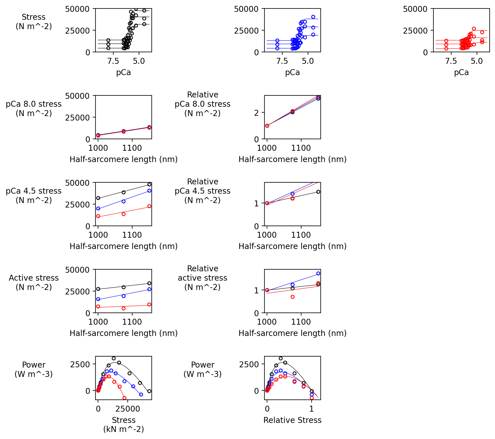

## Simulations

These instructions should allow you to duplicate this figure from de novo simulations. (Note this example was generated using m_n = 4, so it's "noisy" because of low stochastic averaging - see below.)

They assume you are very "technical" and are comfortable with GitHub etc. Please ask if you need further help.



## Steps

+ Pull the latest FiberSim code from [https://github.com/campbell-muscle-lab/FiberSim/](https://github.com/campbell-muscle-lab/FiberSim/)

+ Note the installation directory which will be referred to as `<repo>`. For Ken's PC, that would be `c:/ken/github/campbellmusclelab/models/FiberSim` which will contain the following directories.

````
C:/ken/github/campbellmusclelab/models/
+---FiberSim
|   +---bin
|   +---code
|   +---demo_files
|   +---docs
|   +---doxygen
|   +---manuscripts
````

+ Using Anaconda, create a Python environment called FiberSim from
`<repo>/code/FiberPy/environment/environment.yml`

+ Pull the additional repo at [https://github.com/kenatcampbellmusclelab/project_hopkins_mechanics](https://github.com/kenatcampbellmusclelab/project_hopkins_mechanics)

+ Note the installation directory for this project, which will be referred to as `<repo_hopkins>`. For Ken's PC that would be
`C:/ken/github/campbellmusclelab/projects/project_hopkins_mechanics`

````
C:/ken/github/campbellmusclelab/projects/project_hopkins_mechanics
\---simulations
    +---base
    +---generated
    +---Python_code
    \---sim_data
````

+ Now we need to adjust some paths for your local machine.

+ Open `<repo_hopkins>/simulations/Python_code/characterize_models.py` in an editor
  + For both
    + Line 23
    + Line 24
  + change the beginning of the path so that it points to the appropriate directory.

  Ken's code looks like

````
sys.path.append('c:/ken/github/campbellmusclelab/models/fibersim/code/fiberpy/fiberpy/package/modules/analysis')
FiberSim_code_dir = 'c:/ken/github/campbellmusclelab/models/fibersim/code/fiberpy/fiberpy'
````

+ Now open `<repo_hopkins>/simulations/base/setup.json` in an editor.
  + On line 5, change the path to the exe file to point to the FiberSim bin directory.

  Ken's code looks like this.

````
"exe_file": "c:/ken/github/campbellmusclelab/models/fibersim/bin/FiberCpp.exe"
````

  + While you have this file open, the `m_n` values on lines 19 and 36 define the number of thick filaments in each simulation. This number has to be an integer square, and 4 is the lowest possible value.
  
  + You should probably run the simulations with `m_n` = 4 first to make sure everything works correctly.
  
  + Then, if things work, come back and re-run with larger values to get smoother records from the stochastic averaging. You can use integer squares, so 9, 16, 25, etc. up to 196. Going above 100 probably doesn't make much difference but the simulations take a lot longer.

+ To run the simulations, open an Anaconda prompt and activate the FiberSim environment.

+ Change directory to ``<repo_hopkins>/simulations/Python_code/`

+ Type `python characterize_models.py`

+ You should see a stream of text indicating that simulations are running.

+ If everything works as it does for Ken, you should eventually see:
  + results files for length-control experiments in `<repo_hopkins>/simulations/sim_data/pCa_length_control/sim_output`
  + results files for force-control experiments in 
`<repo_hopkins>/simulations/sim_data/fv_pCa45/isotonic/sim_output`

+ The "goal image" at the top of this page should be at
`<repo_hopkins>/simulations/sim_data/pCa_length_control/sim_output/summary_figure.png`

